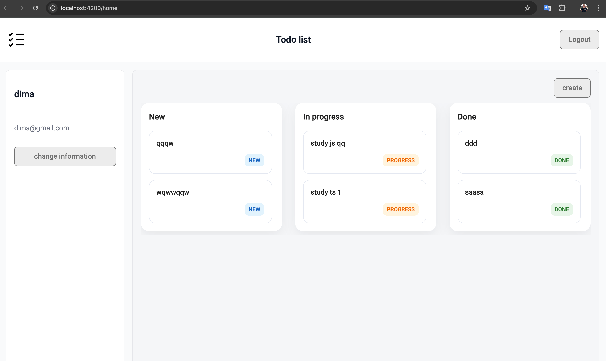
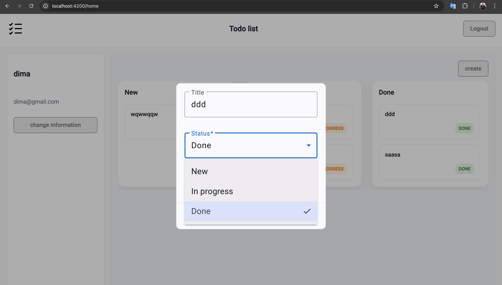

# Angular Task Manager

A modern task management application built with Angular, RxJS and TypeScript.  
The project demonstrates reactive programming patterns, state management with RxJS, and integration with REST APIs.

This project was created as part of my frontend portfolio while focusing on Angular development.

## Database

The application automatically initializes the database on startup.

Tables are created via SQL migrations and demo data is inserted for testing.

Demo user:

email: demo@mail.com  
password: 123456

---

## Features

- Create, edit and delete tasks
- Reactive state management using RxJS
- REST API integration
- Responsive UI
- Component-based architecture
- Form validation

---

## Tech Stack

Frontend

- Angular
- TypeScript
- RxJS
- HTML5
- CSS / SCSS

Backend (development)

- json-server / Firebase (depending on your version)

Tools

- Git
- npm
- Angular CLI

---

## Architecture

The project follows a modular Angular structure:

- Feature modules
- Reusable components
- Services for API communication
- RxJS Observables for reactive data flow

Example concepts demonstrated:

- Observable streams
- async pipe
- service-based architecture
- separation of UI and business logic

---

## Screenshots

### Login page



### Home page


### Task Editing



---

## Installation

Clone the repository

```bash
git clone https://github.com/yurii-donnikov/angular-task-manager.git
```
